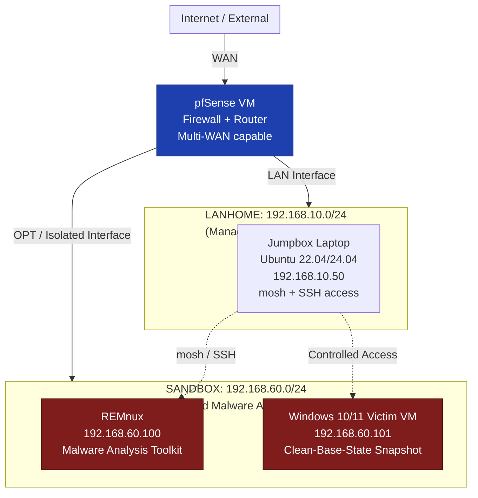

# 🛡️ Bennett's Cybersecurity Homelab

**Personal Portfolio Project | Malware Analysis • Network Defense • SOC Skills**

[](https://www.pfsense.org/)
[](https://securityonion.net/)
[](https://remnux.org/)
[](https://ubuntu.com/)
[](https://www.microsoft.com/windows/)

**Version:** May 2026 (GitHub Edition)  
**Status:** Active | Continuously Improved  
**Author:** Bennett Fielding Love Jr. — U.S. Army Combat Veteran (20+ years), CompTIA Security+ / CySA+ / A+ / Network+, Lean Six Sigma Yellow Belt

---

## 🎯 Project Purpose

This repository documents my hands-on **cybersecurity homelab** built for practical learning, certification preparation (SecurityX/CASP+, CBROPS, CCNA, CEH), and portfolio development as I transition into cybersecurity/IT roles (SOC Analyst, Cloud Security, Network Defense, Helpdesk).

**Goals:**
- Master isolated malware analysis workflows
- Build and operate a segmented network with pfSense + Security Onion
- Practice blue-team skills: log analysis, detection, incident response simulation
- Create shareable, professional documentation that demonstrates real-world skills to employers
- Support neurodivergent-friendly study (short, focused sessions with clear checklists and scripts)

The lab emphasizes **safety, repeatability, and documentation** — core principles from my military background in radar/EW/targeting and current contractor/IT work.

---

## 🏗️ Network Architecture

### High-Level Diagram



### Components

| Subnet / Host          | IP Address          | Purpose                              | OS / Notes                     |
|------------------------|---------------------|--------------------------------------|--------------------------------|
| **LANHOME**            | 192.168.10.0/24    | Management & daily operations       | —                              |
| Jumpbox                | 192.168.10.50      | Primary control / SSH jump host     | Ubuntu (WSL or native laptop) |
| **SANDBOX** (Isolated) | 192.168.60.0/24    | Malware detonation & analysis       | Separate pfSense interface     |
| REMnux                 | 192.168.60.100     | Static + dynamic malware tools      | REMnux distro                  |
| Windows Victim VM      | 192.168.60.101     | Safe execution environment          | Windows 10/11 + snapshots      |
| pfSense                | —                  | Firewall, routing, segmentation     | Virtualized (Proxmox / ESXi / VirtualBox) |

**Key Design Principles:**
- Strict isolation between management (LANHOME) and analysis (SANDBOX) networks
- Jumpbox as the single controlled entry point
- pfSense handles firewall rules, NAT, and traffic shaping between zones
- All malware-related activity stays inside the SANDBOX

---

## 🚀 Getting Started (Clone & Use)

```bash
git clone https://github.com/YOUR-USERNAME/cybersecurity-homelab.git
cd cybersecurity-homelab
```

### Prerequisites
- pfSense VM (or hardware)
- Ubuntu machine/laptop as Jumpbox (or WSL2)
- REMnux VM
- Windows VM with snapshot capability (VirtualBox / VMware / Proxmox)
- Basic networking knowledge

See individual docs in `/docs` for detailed install guides (coming soon).

---

## 🛠️ Useful Aliases & Automation Scripts

All aliases are intended to be sourced on the **Jumpbox**.

### Quick Reference Table

| Command            | Description                                      | Implementation                  |
|--------------------|--------------------------------------------------|---------------------------------|
| `jump`             | Connect to Jumpbox via mosh                      | `mosh user@192.168.10.50`      |
| `remnux`           | SSH directly to REMnux                           | `ssh remnux@192.168.60.100`    |
| `fileserver`       | Start Python upload web server on REMnux         | `python3 -m http.server ...`   |
| `sandbox-capture`  | Start tcpdump for SANDBOX traffic                | Custom script                   |
| `sandbox-status`   | Quick ping + connectivity health check           | `scripts/sandbox-status.sh`    |

### Scripts in `/scripts`

- `sandbox-status.sh` — Pings key hosts and reports status
- `aliases.sh` — Source this file to load convenient functions
- More automation coming (VM snapshot helpers, log parsers, etc.)

**Example usage after sourcing:**
```bash
source scripts/aliases.sh
sandbox-status
```

---

## 📋 Daily Startup Checklist

1. Start **pfSense** VM (ensure WAN/LAN/OPT interfaces up)
2. Power on **Jumpbox** laptop
3. On main Windows host → open WSL Ubuntu terminal → type `jump`
4. Run connectivity check: `sandbox-status`
5. Start file server on REMnux: `fileserver`
6. Start **Windows Victim VM** → **revert to "Clean-Base-State" snapshot first**
7. (Optional) Full connectivity test:
   ```bash
   ping 192.168.60.100   # REMnux
   ping 192.168.60.101   # Windows Victim
   ```

---

## 🔄 File Transfer Workflow (Main Host → Victim VM)

**Recommended Safe Method (Python Upload Server)**

1. On main Windows host, place sample file (keep as `.zip`) in:  
   `C:\Users\benne\Documents\Sandbox\Samples\`
2. On Jumpbox: `fileserver`
3. On main Windows host browser: visit `http://192.168.60.100:8000/upload.html`
4. Upload the zipped sample
5. On **Windows Victim VM** browser: visit `http://192.168.60.100:8000` and download

This keeps the main host clean and uses the isolated REMnux as the transfer broker.

---

## 🔍 Static Analysis Commands (on REMnux)

```bash
cd ~/samples

# Basic file identification
file *.exe
md5sum *.exe
sha256sum *.exe

# Extract strings for quick review
strings *.exe > strings.txt
less strings.txt          # Use / to search, q to quit

# Focused interesting strings
strings *.exe | grep -E "http|https|powershell|cmd|run|regsvr32|dll|exe|360|paint|opencv|inject" | head -100
```

See `docs/static-analysis-cheatsheet.md` for expanded version (planned).

---

## 🏃 Dynamic Analysis Best Practices

### Preparation
- Revert Windows Victim VM to **Clean-Base-State** snapshot
- Launch **ProcMon** (filter on sample filename)
- Launch **Process Hacker**
- On Jumpbox: start packet capture with `sandbox-capture`

### Execution
- Run the sample for **maximum 30–60 seconds**
- Stop capture (`Ctrl+C`)
- **Immediately** revert the Victim VM to clean snapshot

### Review
- Analyze ProcMon log for registry writes, file creation, process injection
- Review capture:
  ```bash
  tcpdump -r /tmp/sandbox_capture.pcap -nn -A | less
  ```

Full workflow and tool recommendations in `/docs/dynamic-analysis-playbook.md`.

---

## 🛡️ Safety & Reset Rules (Non-Negotiable)

- **Never** execute malware samples on your main Windows host or production machines
- **Always** revert the Victim VM to a clean snapshot after every run
- Keep all samples zipped until ready for analysis
- Regularly run `sandbox-status` to verify isolation
- Document every analysis session (date, sample hash, findings, lessons)

---

## 📸 Screenshots & Visual Evidence

(Add your own screenshots here — highly recommended for portfolio impact)

**Planned additions:**
- pfSense dashboard with firewall rules
- Security Onion Kibana / alerts overview
- REMnux desktop with analysis tools
- Packet capture examples
- Before/after VM states

Place images in `/images/` and reference them in Markdown.

---

## 🔮 Roadmap / Future Improvements

- [ ] Detailed pfSense configuration guide + exported rules
- [ ] Security Onion sensor deployment + custom dashboards
- [ ] Automated snapshot + revert scripts (VirtualBox / Proxmox)
- [ ] Python automation for log parsing and report generation
- [ ] Integration with Wazuh / Splunk (if added)
- [ ] YARA / Sigma rule examples from lab activity
- [ ] Full incident response simulation playbook
- [ ] Cost & power efficiency notes for home lab

---

## 📄 License

This project is licensed under the **MIT License** — see the [LICENSE](LICENSE) file for details.

You are free to use, modify, and share the documentation and scripts. Attribution appreciated but not required.

---

## 🙏 Credits & Inspiration

- My U.S. Army service (131A Radar / Targeting / EW) — instilled discipline in documentation, checklists, and systematic troubleshooting
- REMnux, Security Onion, and pfSense communities
- Various blue-team homelab builders on GitHub and YouTube

---

**Questions or suggestions?** Open an issue or reach out on LinkedIn / X.

*Built with ❤️ for continuous learning and career transition into cybersecurity.*
